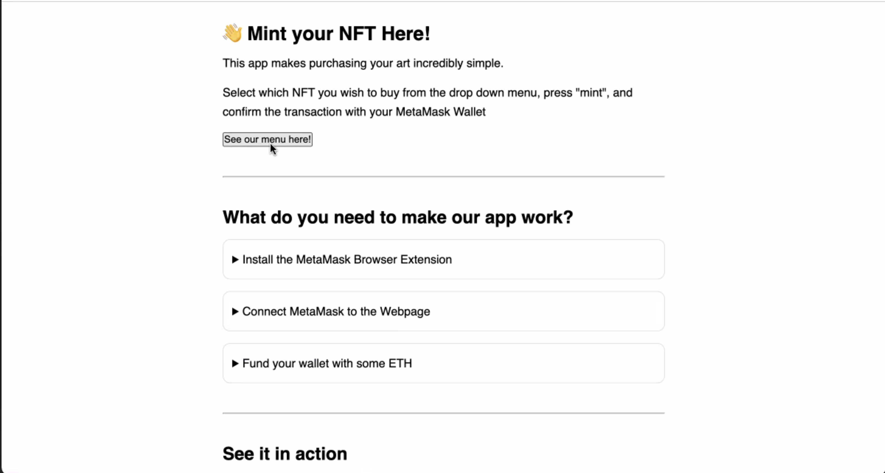

# Project_3

# Primary application file

Develop NFTs to be sold using Metamask and when you receive the NFT in your Metamask wallet and present it at a location you will receive complimentary cannabis. This is done to comply with the District of Columbia's law that does not allow you to sell cannabis out right but you can sell items and have complimentary cannabis accompany the purchased item. This will provide convenience to users that can purchase an NFT and then present it to the store for their complimentary cannabis. Convenience is provided to the customer by not having to wait in line at the location and to the store owner by not having to spend time with clients but can have complimentary cannabis available when they arrive. The use of crypto currency is safer for both parties because neither party has to carry cash, it is safer for the customer and business owner. Also, criminals target cannabis shops because they know they have a lot of cash on hand because they can not deposit it into banks. The origin of this project came from a desire to create a business solution for cannabis dispensaries that are operating in the DMV (District, Maryland, and Virginia) area the goal of this business solution was to create a piece of software which when used by thes dispensaries they can give access to greater clientele beyond the borders of Washington DC. By utilizing NFTS on the ETH blockchain network businesses in the gifting industry can confirm their compliance with legislation and they can prove they sold an NFT with compliance with Initiative 71 by emphasizing this record of sale they are able to safeguard themselves from the accusation that a token was not the main item of sale in the exchange.

---

## Technologies

The following Technologies were used to develop this program:

Python 
    Version 3.9.7

Terminal
    Version 2.12.5 (444)
 
Git version 2.24.0.windows.2

Visual Studio Code
    Version: 1.66.2 (Universal)
    Commit: dfd34e8260c270da74b5c2d86d61aee4b6d56977
    Date: 2022-04-11T07:49:20.994Z
    Electron: 17.2.0
    Chromium: 98.0.4758.109
    Node.js: 16.13.0
    V8: 9.8.177.11-electron.0
    OS: Darwin x64 21.4.0
    
    
Remix Etherium IDE

Solidity

React
    

---

## General information about analysis.

This application is a software that allows marajunia dispenseries to comply with local regulation regarding the procedure of distribution and the collection and depositing of funds.

This is accomplished through the sale of non fungible tokens on the ethereum blockchain network.

By selling non fungible tokens distributors like places in Washington DC are able to comply with the requirement that the cannabis products not be sold directly to consumers for cash.  

By using the ETH crypto currency as the medium of exchange in the transactions businesses are able to greater comply with legislation as well as increase the safety of their establishment.

Current law makes it that businesses can not take cash for cannabis products and they can not deposit cash into a recognized federal bank.

The legalization of recreational cannabis with gifting up to one ounce of cannabis as outlined in Initiative 71, has created a gifting economy in which stores and businesses exchange cannabis as a gift for t-shirts or other items such as stickers etc, which are actually being purchased by customers, thereby creating a commercial market linked to selling other objects. This has flourished as an essentially unregulated gray market.

Include by accepting cryptocurrency and they sell cryptocurrency for cash they can liquidate that for fiat currency and deposit those funds into federally recognized banks.

Below is the welcome page to our program that will allow you to purchase non fungible tokens:

---
## New Developments:

### DC Cannabis Law:

### DC cannabis market is like the wild wild west of Weed:

   In 2015 Initiative 71 become law. This laws states that is legal for adults under the age 21 to
   
   Possess two ounces or less of marijuana
        
   Grow up to 6 plants in their personal residence of which three are mature
   
   
### Transfer one ounce or less of marijuana to another person as long as:
   
   No money, goods, or services are exchanged
            
   The recipient is 21 years of age or older
            
   The marijuana must be consumed on private property.
            
   Despite the initiative being voted on and passed by the local DC government the federal government (Congress) does not recognize the law. Due to this lack of recognition the local DC government and its resident codified initiative 71 into law in 2020
   
   Codifying the law was meant to bring in recreational dispensaries, (Which has not happened)
    
    
### New Developments:

   There are two new very serious development in regarding cannabis in DC. One developments good for consumers and medicinal dispensaries and the other is bad for gifting businesses particularly brick and mortar.
    
   New Development #1 - - > DC passed a law for self certification or a medal condition that allows D.C residents to bar eligible for medical cannabis cards as of August 5th 2022. The new certification process removes the need for a physician to be apart of the certification process. This laws give any over the age of 21 immediate access all seven medicinal dispensaries. The downside to this is that in DC the federal government prohibits anyone that gets approve a medicinal marijuana cards can no longer carry a firearm. This law does not apply to non dc residents.
    
   The point of this new legislation is to crackdown on gifting business. The law aims to dive marijuana track from unregulated gifting business to medicinal dispensaries. Also to get around congress blocking it’s local legislation.
    
   New Development #2 - - > The local DC government has created a joint cannabis task force to crack down on gifting business to verify compliance with the district of Columbia legal requirements. The task force consist of the DCRA , Dept of health, Dept of Tax and Revenue and DC fire and emergency medical services. The new law requires edibles and other food products to be approved by dc health and produced in compliance with DC food safety and hygiene laws.

---

## Presentation Link

[Presentation](https://docs.google.com/presentation/d/1206pJ9TbzqUk5hOLltEFpU24qsuN-s3a0OHR3iWc67o/edit#slide=id.g153fbb4e16e_0_119)

---

## Contributors

**Chris Miskovich**

Contact Information:

Email: cmiskovich@verizon.net

[LinkedIn](https://www.linkedin.com/in/christopher-miskovich-9a61b0234/) 

**Antiwan Maxwell**

Contact Information:

Email: antiwan.maxwell@outlook.com

[LinkedIn](https://www.linkedin.com/in/antiwan-maxwell-205a11233/) 

**Joshua Mitchell**

Contact Information:

Email: joshuamitchell5678@gmail.com

**KaBria Broadwater**

Contact Information:

Email: KaBria.Broadwater@gmail.com

[LinkedIn](https://www.linkedin.com/in/kabriabroadwater/)

---

## License

[MIT](/license.txt)
